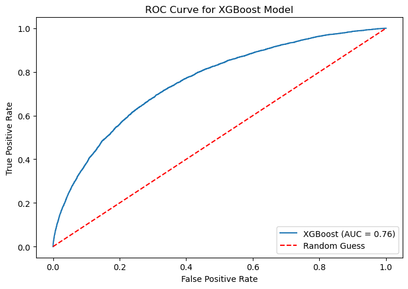
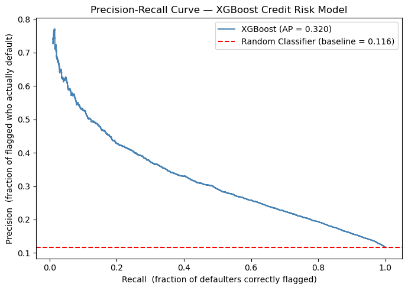
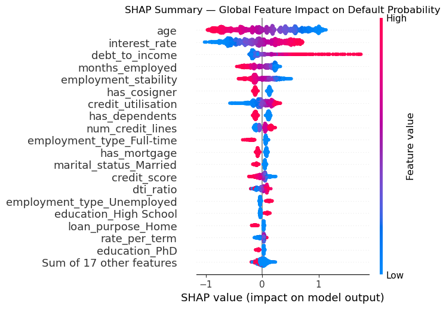
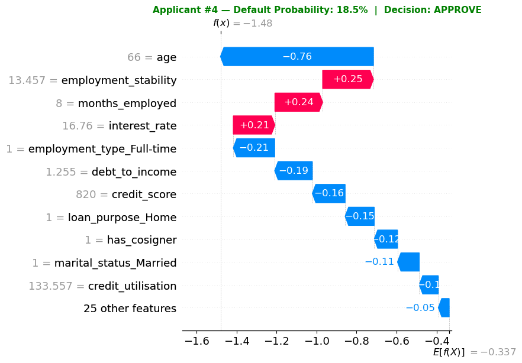
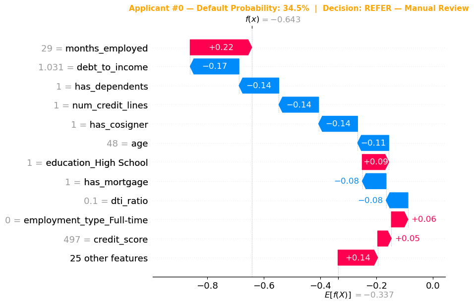
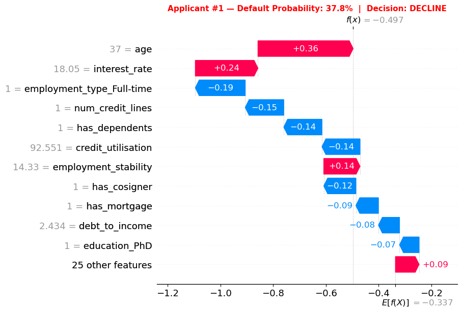

# 🏦 Credit Risk Scoring Model

> An end-to-end Machine Learning pipeline for consumer loan default prediction — built with XGBoost, SHAP interpretability, and a three-tier underwriting decision framework.

---

## 📋 Table of Contents

- [Project Overview](#project-overview)
- [Business Context](#business-context)
- [Tech Stack](#tech-stack)
- [Project Structure](#project-structure)
- [Dataset & Personas](#dataset--personas)
- [Results](#results)
- [Pipeline Architecture](#pipeline-architecture)
  - [Step 1 — ETL Pipeline](#step-1--etl-pipeline)
  - [Step 2 — Database Management (PostgreSQL + DBeaver)](#step-2--database-management-postgresql--dbeaver)
  - [Step 3 — Behavioural Features via Plaid Sandbox API](#step-3--behavioural-features-via-plaid-sandbox-api)
  - [Step 4 — Feature Engineering & Preprocessing](#step-4--feature-engineering--preprocessing)
  - [Step 5 — Model Training & Hyperparameter Tuning](#step-5--model-training--hyperparameter-tuning)
  - [Step 6 — Model Evaluation](#step-6--model-evaluation)
  - [Step 7 — SHAP Explainability](#step-7--shap-explainability)
  - [Step 8 — Programmatic Underwriting Decision Policy](#step-8--programmatic-underwriting-decision-policy)

- [Model Persistence](#model-persistence)
- [Limitations & Future Work](#limitations--future-work)
- [Author](#author)

---

## Project Overview

This project builds a **production-style credit risk scoring model** that predicts the probability of loan default for individual applicants. Given a set of financial, behavioural, and demographic features, the model outputs a probability score and maps it to one of three underwriting decisions: **Approve**, **Refer for Manual Review**, or **Decline**.

The project demonstrates a complete, modular Data Science workflow: from raw data ingestion and database management, through feature engineering and model training, to explainability and business-ready outputs.

---

## Business Context

Credit default risk is one of the most consequential problems in retail banking. A lender that approves too many high-risk borrowers accumulates bad debt; one that is too conservative rejects creditworthy applicants and loses revenue. A well-calibrated scoring model allows lenders to:

- **Automate low-risk approvals** and free credit officers for edge cases
- **Quantify risk per applicant** rather than relying on manual rules
- **Explain decisions** to regulators, auditors, and the applicants themselves
- **Monitor fairness** across employment types and demographic groups

This model targets a dataset of **51,000 loan applications** with an **11.6% historical default rate** — a realistic class imbalance representative of consumer lending portfolios.

---

## Tech Stack

| Category | Tools |
|---|---|
| **Language** | Python 3.12 |
| **Environment** | Anaconda, `conda` virtual environment |
| **Database** | PostgreSQL 16 (Remote Linux Server)|
| **Database GUI** | DBeaver Community Edition, SQLTools fo VSCode |
| **Data Access** | SQLAlchemy, `psycopg2` |
| **Behavioural Data** | Plaid API (Sandbox) |
| **Data Processing** | pandas, NumPy |
| **ML Pipeline** | scikit-learn (`Pipeline`, `ColumnTransformer`, `RandomizedSearchCV`) |
| **Model** | XGBoost (`XGBClassifier`) |
| **Explainability** | SHAP (`TreeExplainer`, beeswarm, waterfall, dependence plots) |
| **Visualisation** | Matplotlib |
| **Model Serialisation** | joblib / pickle |
| **Config Management** | `python-dotenv` |
| **IDE** | Posit "Positron" (Data Science IDE), Jupyter Notebook |

---

## Project Structure

```
credit_risk/
│
├── data/
│   ├── raw/                        # Original source files — read-only, never modified
│   └── processed/                  # Cleaned, enriched datasets output by the ETL pipeline
│
├── models/
│   ├── model_training/             # ML pipeline scripts (train, evaluate, explain, run)
│   │   ├── run_pipeline.py         # Master entrypoint — orchestrates all steps
│   │   ├── train_xgb_model.py      # Pipeline construction and hyperparameter tuning
│   │   ├── evaluate_model.py       # ROC AUC and Precision-Recall evaluation
│   │   └── explain_model.py        # SHAP explainer, summary, dependence, waterfall plots
│   └── modeling_table.csv          # Final flattened model dataset (one row per applicant)
│
├── reports/                        # Final deliverables: notebook report, Excel scorecard
│
├── scripts/                        # CLI entry points for retraining or scoring new applicants
│
├── src/                            # Shared library code (ETL, feature engineering, utilities)
│   └── etl.py                      # Full ETL pipeline: extract → validate → transform → load
│
├── .gitignore
└── requirements.txt                # Frozen Python dependencies
```

---

## Dataset & Personas

The raw dataset obtained contains **255k+ rows** and is complete with applicant demographics, financials, and loan attributes that can be used to analyze default drivers and train models.
This raw dataset was enriched using the **Plaid Sandbox API** in order to simulate a realistic consumer transactional pattern and create a realistic loan portfolio. Each record includes:

- **Applicant profile**: age, income, education, marital status, employment type
- **Loan characteristics**: amount, term, interest rate, purpose
- **Credit behaviour**: credit score, number of credit lines, DTI ratio, mortgage/cosigner flags
- **Target variable**: `default` (1 = defaulted, 0 = repaid) — **11.6% default rate**

Data sources: [[1]](#footnotes)

### Risk Personas

Each applicant is assigned a **risk persona** during the ETL stage based on a rule hierarchy applied to their financial profile. This persona is used as a segmentation feature downstream and allows the model to handle subpopulations with structurally different risk profiles.

| Persona | Definition |
|---|---|
| `gig-worker` | Self-employed individuals with higher income volatility |
| `financially-stretched` | Income < £40k and DTI ratio > 0.40 |
| `stable-low-risk` | Income > £90k and DTI ratio < 0.25 |
| `joint-borrower` | Has a cosigner on the loan |
| `bonus-income` | Income > £70k with 5+ years employment |
| `broad-income-mix` | Mid-to-high income, moderate DTI, no obvious risk flags |
| `mainstream` | All remaining applicants — further sub-segmented during training (see below) |

The `mainstream` persona — the largest group — is further **refined into sub-groups** to prevent the model from treating it as a single homogeneous population:

| Sub-Persona | Criteria |
|---|---|
| `mainstream-stable` | Income > £40k and DTI < 0.50 |
| `mainstream-low-income` | Income ≤ £40k and DTI ≤ 0.40 |
| `mainstream-leveraged` | DTI > 0.50 regardless of income |
| `mainstream-other` | All remaining mainstream applicants |

---

## Results

```
Dataset:         51,000 loan applications
Default rate:    11.6% (class imbalance handled via scale_pos_weight ≈ 7.6)
Train/test split: 80/20, stratified

Cross-validation (5-fold):   AUC = 0.76
Out-of-sample Test:          AUC = 0.76
Average Precision (AP):      0.320
Random baseline (AP):        0.116
Lift over random:            2.76×
```

> 📊 See sections [SHAP Beeswarm Plot](#step-7--shap-explainability) for global feature importance and [Precision-Recall Curve](#step-6--model-evaluation) for full evaluation visuals.

---

## Pipeline Architecture

The project is structured as a **linear, modular pipeline** where each step produces a well-defined output consumed by the next. The master entrypoint is `run_pipeline.py`.

```
Raw CSV
   │
   ▼
[Step 1] ETL Pipeline (etl.py)
   │  → Standardise, validate, encode, assign personas
   │  → Load to PostgreSQL via SQLAlchemy
   ▼
[Step 2] PostgreSQL Database (DBeaver)
   │  → Schema management, JOIN queries, data exploration
   ▼
[Step 3] Plaid API Enrichment
   │  → Behavioural transaction features merged onto loan table
   ▼
[Step 4] Feature Engineering & Preprocessing (model_table_preprocess.py)
   │  → Derived features, ColumnTransformer, train/test split
   ▼
[Step 5] Model Training (train_xgb_model.py)
   │  → XGBoost + RandomizedSearchCV (50 iter, 5-fold CV)
   ▼
[Step 6] Evaluation (evaluate_model.py)
   │  → ROC AUC, Precision-Recall Curve, Average Precision
   ▼
[Step 7] Explainability (explain_model.py)
   │  → SHAP global summary, dependence plots, per-applicant waterfall
   ▼
[Step 8] Underwriting Decision Engine
      → APPROVE / REFER / DECLINE per applicant
```

---

### Step 1 — ETL Pipeline

**File:** `src/etl.py`

The ETL pipeline ingests the raw loan CSV, applies a sequence of deterministic transformations, and loads the result into a PostgreSQL database. It is designed to be fully reproducible: given the same input file, it always produces the same output.

The pipeline follows a strict function-per-stage design:

```
extract()              → Load raw CSV from INPUT_PATH (.env)
standardise_columns()  → Lowercase headers, rename to snake_case
validate()             → Assert required columns, check for nulls,
                          validate binary columns (Yes/No only)
encode_binary_columns() → Map Yes/No → 1/0 (has_mortgage, has_dependents, has_cosigner)
engineer_features()    → dti_ratio_pct = dti_ratio × 100
                          years_employed = months_employed / 12
                          loan_term_years = loan_term / 12
create_persona_profiles() → Assign risk persona per applicant (rule-based)
enforce_dtypes()        → Cast each column to its target PostgreSQL dtype
reorder_columns()       → Enforce OUTPUT_COL_ORDER for consistent schema
load to PostgreSQL      → Via SQLAlchemy engine (credentials from .env)
```

All secrets (database host, port, credentials, file paths) are managed via a `.env` file and loaded with `python-dotenv` at runtime. The `.env` file is never committed to version control.

---

### Step 2 — Database Management (PostgreSQL + DBeaver)

**Tools:** PostgreSQL 16, DBeaver Community Edition, SQLAlchemy

Once the ETL pipeline runs, the clean loan data is loaded into a local **PostgreSQL** database (`credit_risk`) under the `raw` schema. PostgreSQL was chosen over file-based storage because it enforces column types, supports schema versioning, and allows JOIN operations across multiple data sources.

**DBeaver** was used throughout the project as the database GUI for:

- **Schema inspection** — verifying that `etl.py` loaded data with the correct column types and row counts
- **Ad-hoc SQL queries** — exploring distributions, checking persona counts, and validating the JOIN between the loan table and Plaid behavioural features
- **Building the modelling table** — writing and testing the SQL JOIN that merges loan records with behavioural transaction features into a single model-ready table, before translating it into a Python script
- **Data quality checks** — running null counts, duplicate checks, and value distribution queries to validate the ETL output

The connection to PostgreSQL from Python is managed via `SQLAlchemy`:

```python
from sqlalchemy import create_engine

engine = create_engine(f"postgresql://{DB_USER}:{DB_PASSWORD}@{DB_HOST}/{DB_NAME}")
df_clean.to_sql(table_name, engine, schema="raw", if_exists="replace", index=False)
```

---

### Step 3 — Behavioural Features via Plaid Sandbox API 

**Tool:** Plaid Sandbox API

To enrich the loan dataset with real-world behavioural signals, the project integrates with the **Plaid API Sandbox environment**. Plaid provides simulated bank transaction histories for a set of synthetic personas, enabling the derivation of spending and income behaviour features that are not available from a traditional credit application form.

The following behavioural features were extracted from transaction histories and joined onto the loan table:

| Feature | Description |
|---|---|
| `avg_monthly_inflow` | Average monthly income deposited (£) |
| `income_stability_ratio` | Consistency of income over the last 12 months |
| `spend_to_income_ratio` | Monthly spend as a fraction of monthly income |
| `months_net_negative_6m` | Number of months in the past 6 where outflows > inflows |
| `cash_withdrawal_ratio` | Fraction of transactions that are cash withdrawals |

These features are **only available for Plaid-enriched personas**. For applicants in the `mainstream` persona (who have no Plaid data), these columns are `NaN` by design. A **missing indicator flag** (`*_missing = 1`) is added for each behavioural column so the model explicitly learns from the absence of these signals rather than imputing arbitrary values.

---

### Step 4 — Feature Engineering & Preprocessing

**File:** `models/model_training/model_table_preprocess.py`

Before training, several **derived features** are constructed from raw columns to capture financial relationships the model would not otherwise detect:

| Feature | Formula | Rationale |
|---|---|---|
| `debt_to_income` | `loan_amount / (income + 1)` | Loan burden relative to earning capacity |
| `rate_per_term` | `interest_rate / loan_term` | Monthly cost of borrowing |
| `credit_utilisation` | `loan_amount / (credit_score + 1)` | Loan size relative to creditworthiness |
| `employment_stability` | `log1p(income × months_employed)` | Combined income and tenure signal, log-compressed to prevent scale distortion |

The `log1p` transform on `employment_stability` is critical: the raw product of `income × months_employed` produces values in the millions, which would dominate the feature space and produce uninterpretable SHAP values. `log1p(x)` compresses the range to ~8–15, keeps the monotonic relationship intact, and handles zero values safely.

**Preprocessing** is handled by a scikit-learn `ColumnTransformer` inside the main `Pipeline`:

```
Numerical features  → SimpleImputer(strategy='median')
Categorical features → SimpleImputer(strategy='most_frequent')
                      → OneHotEncoder(handle_unknown='ignore')
```

The train/test split uses **stratification on the target variable** (`stratify=y`) to preserve the 11.6% default rate in both sets, and a fixed `random_state=13` for reproducibility.

---

### Step 5 — Model Training & Hyperparameter Tuning

**File:** `models/model_training/train_xgb_model.py`

The model is an **XGBoost Gradient Boosting Classifier** (`XGBClassifier`) wrapped in a scikit-learn `Pipeline` alongside the preprocessor. This ensures the entire transformation and prediction logic is encapsulated in a single serialisable object.

**Class imbalance** (11.6% default rate) is addressed using the `scale_pos_weight` parameter:

```python
scale_pos_weight = (len(y_train) - y_train.sum()) / y_train.sum()
# ≈ 7.6 — tells XGBoost to weight the minority class ~7.6× more heavily
```

**Hyperparameter tuning** uses `RandomizedSearchCV` across the following search space:

| Hyperparameter | Search Values |
|---|---|
| `n_estimators` | 100, 200, 400 |
| `max_depth` | 3, 4, 5, 6 |
| `learning_rate` | 0.01, 0.05, 0.1 |
| `subsample` | 0.6, 0.8, 1.0 |
| `colsample_bytree` | 0.6, 0.8, 1.0 |
| `min_child_weight` | 1, 3, 5 |
| `reg_alpha` | 0, 0.1, 1.0 |
| `reg_lambda` | 1.0, 2.0, 5.0 |

**Configuration:** 50 random iterations, 5-fold cross-validation, scored on `roc_auc`, `n_jobs=-1` (all CPU cores), `random_state=11`.

---

### Step 6 — Model Evaluation

**File:** `models/model_training/evaluate_model.py`

The tuned pipeline is evaluated on the held-out test set (20% of data) using two complementary metrics:

**ROC AUC** measures the model's ability to rank defaulters above non-defaulters across all classification thresholds. It is threshold-agnostic and gives a single summary of discrimination ability.

<p align="center" width="100%">
  
</p>

**Precision-Recall (PR) Curve** and **Average Precision (AP)** are the primary metrics for imbalanced classification. The PR curve shows the trade-off between how many flagged applicants are genuine defaulters (precision) and how many total defaulters are caught (recall). The baseline for a random classifier equals the population default rate (11.6%).

| Metric | Value |
|---|---|
| ROC AUC | **0.76** |
| Average Precision | **0.320** |
| Random Baseline (AP) | 0.116 |
| Lift over Baseline | **2.76×** |

The AP score of 0.320 against a baseline of 0.116 means that when the model flags the highest-risk applicants for rejection, approximately **32% of those flagged are genuine defaulters** — compared to only 11.6% if applicants were flagged at random. This 2.76× lift represents the direct commercial value of the model in reducing bad debt exposure.

<p align="center" width="100%">
  
</p>

---

### Step 7 — SHAP Explainability

**File:** `models/model_training/explain_model.py`

Model predictions are explained using **SHAP (SHapley Additive exPlanations)** with a `TreeExplainer`, which is optimised for gradient boosted trees and produces exact SHAP values efficiently. A background sample of 500 training rows is used to approximate the expected value baseline.

Three types of SHAP visualisation are produced:

**Global Summary (Beeswarm Plot)**
Shows which features drive default risk across the entire test set. Each dot represents one applicant; colour encodes feature value (red = high, blue = low); horizontal position shows the SHAP contribution magnitude and direction.

Top features by mean |SHAP|:

| Rank | Feature | Direction |
|---|---|---|
| 1 | `age` | Younger applicants → higher risk |
| 2 | `interest_rate` | Higher rate → higher risk |
| 3 | `debt_to_income` | Higher DTI → higher risk |
| 4 | `months_employed` | Shorter tenure → higher risk |
| 5 | `employment_stability` | Log-compressed income × tenure signal |


**Feature Dependence Plots**
Generated for the top 5 features. Each plot shows the relationship between a feature's raw value and its SHAP contribution, coloured by the auto-selected interaction feature. This reveals non-linear threshold effects — for example, the sharp increase in `age` risk contribution below a certain age band.

<p align="center" width="100%">
  
</p>

**Waterfall Plots (Per-Applicant Explanation)**
One waterfall is generated for each underwriting band — an example APPROVE, REFER, and DECLINE applicant. Each waterfall shows, feature by feature, how the model arrived at a specific probability from the population baseline (`E[f(X)] = -0.337`), making the decision fully auditable.

<p align="center" width="100%">
  
  
<p/> 
  
<p align="center" width="100%">  
  
</p>

---

### Step 8 — Programmatic Underwriting Decision Policy

The model outputs a continuous default probability for each applicant. This probability is mapped to a three-tier underwriting decision using fixed thresholds calibrated against the acceptable bad rate for each band.

_The three-tier schema thresholds are for demonstration purposes only, and do not reflect necessarily the banking industry typical approach to lending scoring._


| Decision | Probability Threshold | Interpretation |
|---|---|---|
| ✅ **APPROVE** | < 0.20 | Bad rate ≤ 2.2% — within loss tolerance, auto-approve |
| 🟡 **REFER — Manual Review** | 0.20 – 0.35 | Bad rate 2.2–3.9% — borderline, refer to credit officer |
| ❌ **DECLINE** | > 0.35 | Bad rate > 3.9% — outside risk appetite, auto-decline |

This decision framework transforms the continuous model output into actionable lending policy, directly connecting the model to a business process.

---

## Model Persistence

The trained pipeline — including the fitted `ColumnTransformer` preprocessor and the optimised `XGBClassifier` — is serialised to disk using `joblib`, enabling deployment without retraining:

```python
import joblib

# Save
joblib.dump(tuned_pipeline, 'models/xgb_credit_risk_pipeline.pkl')

# Load and score new applicants
pipeline = joblib.load('models/xgb_credit_risk_pipeline.pkl')
probabilities = pipeline.predict_proba(new_applicants)[:, 1]
```

Due to safety and cybersecurity reasons, the script and `.pkl` artifact are excluded from version control via `.gitignore`.
To reproduce the saved model, run the training pipeline from the data sources, included in the repository.

---

## Limitations & Future Work

**Current limitations:**

- The dataset is **synthetically generated**. The methodology and pipeline are fully transferable to real bureau data, but the specific model weights and thresholds would need recalibration.
- The Plaid integration uses the **Sandbox environment**. In production, real transaction data would require either OAuth consent flows and live API credentials, or SQL queries from a production database.
- The current pipeline does not include **model monitoring** or **drift detection**. A deployed model would require periodic retraining as the applicant population evolves.
- A USA industry-standard **fairness audit** (4/5ths rule) across employment types is partially implemented but not yet a blocking gate in the pipeline.


Note: 
It is worth to highlight that UK regulators such as the Financial Conduct Authority (FCA) and the Information Commissioner's Office (ICO) do not impose a strict fixed-threshold or a defined mathematical approach to lending scoring, and they simply encourage that algorithmic processing systems must not produce unjustified adverse effects or discriminatory impacts.
For the purpose of proof-of-concept and outlining a clearer project outcome, the USA Code of Federal Regulations Adversarial Impact approach (80% percent rule, or 4/5ths of the highest score class) is applied.
Footnotes at the end of the project will redirect the viewer for further research: [[2]](#footnotes)


**Potential next steps:**

- Integrate MLflow for experiment tracking and model versioning
- Add a FastAPI scoring endpoint to serve predictions via REST
- Build a Streamlit dashboard for interactive applicant scoring
- Implement automated threshold recalibration based on target bad rate
- Add population stability index (PSI) for monitoring score drift
- Extend Plaid enrichment to cover vast/different array of persona groups

---

## Author

<p align="center" width="100%">
  
</p>

<p align="center">
  <strong>Brian Tomassoni</strong><br>
  <em>Data Analyst · Data Scientist · ML Engineer · Credit Risk Domain</em>
</p>

<p align="center">
  <a href="https://www.linkedin.com/in/brian-tomassoni">
    
  </a>
  &nbsp;
  <a href="https://github.com/tomasb1805">
    
  </a>
  &nbsp;
  <a href="mailto:tmsbrn2019@proton.me">
    
  </a>
</p>

<p align="center">
  Built as a portfolio project demonstrating end-to-end ML system design,<br>
  credit risk domain knowledge, and production-aware engineering practices.
</p>

## Footnotes

### Data sources [1]:
- Raw dataset:
https://www.gigasheet.com/sample-data/loan-default-prediction-dataset
- Plaid Sandbox API:
https://plaid.com/docs/api/sandbox/


### Further research sources [2]: 
- Code of Federal Regulations (USA): 
https://www.ecfr.gov/current/title-29/subtitle-B/chapter-XIV/part-1607/subject-group-ECFRdb347e844acdea6/section-1607.4

- A Pilot Study into Bias in
Natural Language Processing (FCA - UK)
https://www.fca.org.uk/publication/research-notes/pilot-study-bias-natural-language-processing.pdf

- Summary of Feedback Received on
the Engagement Paper proposing
AI Live Testing (FCA - UK)
https://www.fca.org.uk/publication/feedback/fs25-5.pdf

- Guidance on AI and Data Protection: What about fairness, bias and discrimination?
(ICO - UK)
https://ico.org.uk/for-organisations/uk-gdpr-guidance-and-resources/artificial-intelligence/guidance-on-ai-and-data-protection/how-do-we-ensure-fairness-in-ai/what-about-fairness-bias-and-discrimination/
